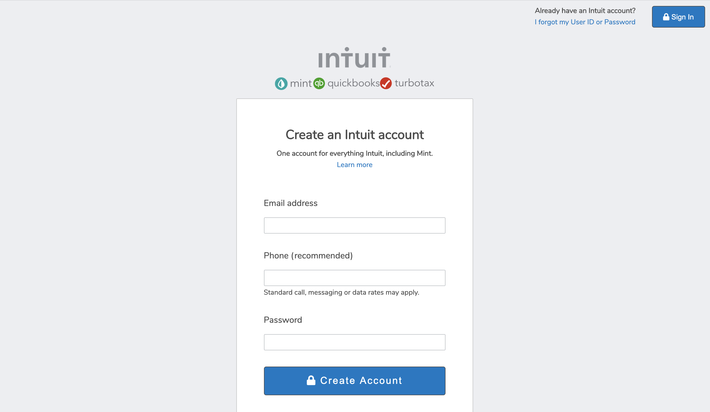

# HTML Forms

> This project was developed as a learning project part of the Microvese curriculum



An HTML and CSS mockup of the mints.com signup page. We used Grid and Flexbox CSS properties to achieve the same layout and proportions of the original page

## Live demo

🔗 [Mint's Sign up page](https://raw.githack.com/lirad/html-forms/features/index.html)

## Built With

- HTML5,
- CSS3,
- Google Fonts,
- Font awesome


## Getting Started

To get a local copy up and running follow these simple example steps.

### Prerequisites

Webbrowser and access to internet

### Install

1) [Download](https://github.com/enkog/Embedding-images-and-videos/archive/master.zip) or clone the repository to your machine;

```sh
$ git clone https://github.com/enkog/Embedding-images-and-videos.git 
```

2) In case you downloaded the project uncompress it;

3) Navigate to the project folder and execute the "index.html" file.

### Usage

Just navigate through the page the only functioning part of the project is the video player

## Authors

👤 **Diego Lira**

- Github: [@lirad](https://github.com/lirad)
- Twitter: [@lirad](https://twitter.com/lirad)


👤 **Nkiruka Awotoruvie**

- Github: [@enkog](https://github.com/enkog)
- Twitter: [@enkodes](https://twitter.com/enkodes)


## 🤝 Contributing

Contributions, issues and feature requests are welcome!

Feel free to check the [issues page](issues/).

## Show your support

Give a ⭐️ if you like this project!

## Acknowledgments

- Microverse for showing the way for this project to happen

## 📝 License

This project is [MIT](lic.url) licensed.
